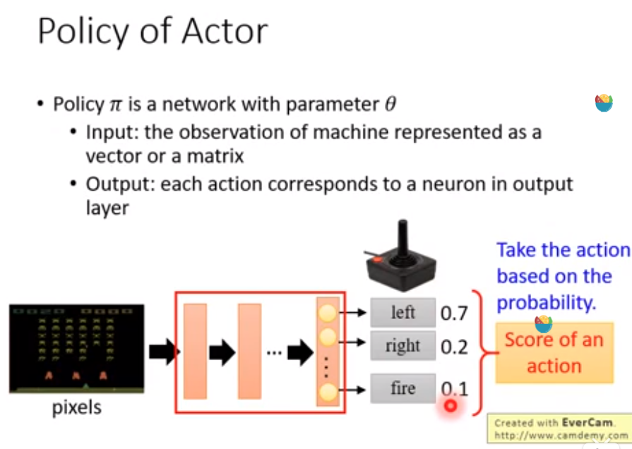

## Policy Gradient

- #### policy of actor

  

  - pixels：输入
  - DNN：agent
  - actor输出
  
- #### actor，env，reward

  

- #### policy gradient

  

  

  - 更新参数

    

    需要收集多组<state,action>

  - 实际部署

    

    - add a Baseline

      

      **解决所有R都为正的问题**

    - Assign Suitable Credit

      