## Q-learning

#### Critic

- 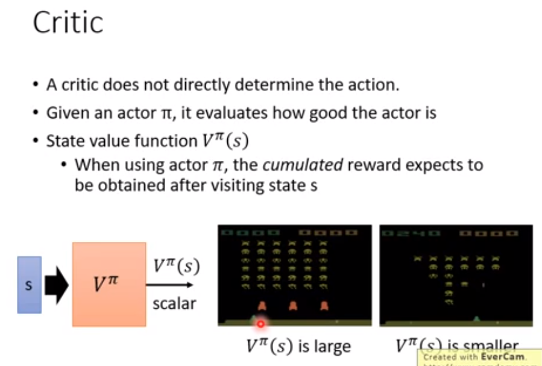

  衡量actor好坏，需要给定状态s和/pi

  相同actor，不同策略获得奖励不同

- estimate

  - **MC-based**

   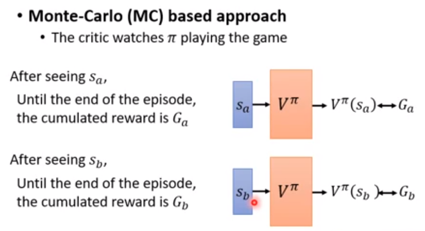

  - **TD-Based**

    

  - Q-function

    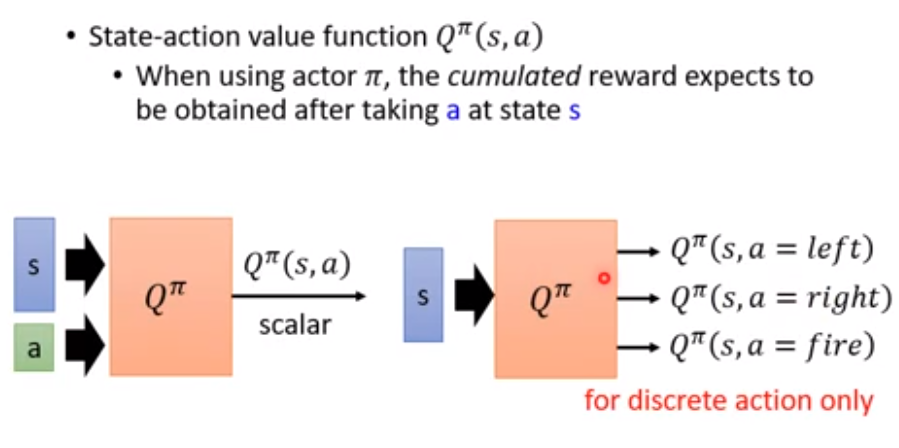

    固定状态下固定动作得到的奖励。

  - Q-Learning

    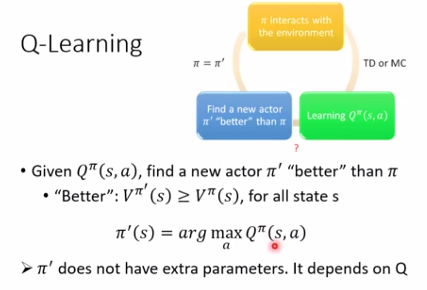

#### Target Network

​		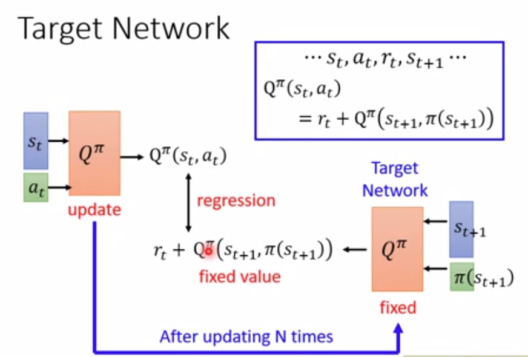

​	训练updata网络多次后，在更新fixed的参数（参数复制）

#### Replay Buffer

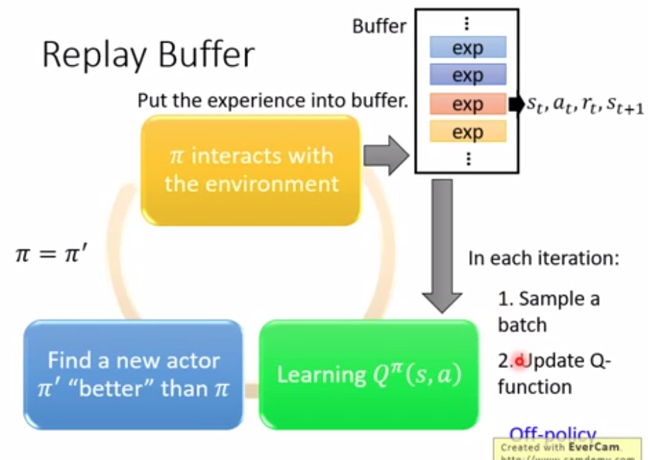

- replay buffer：减少与环境互动的次数

#### Double DQN

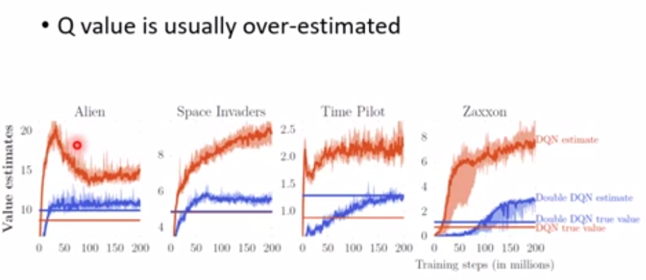

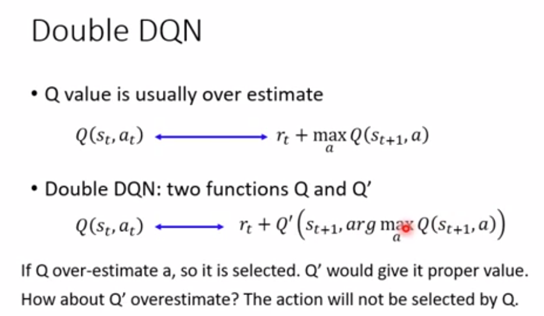、

#### Dueling DQN

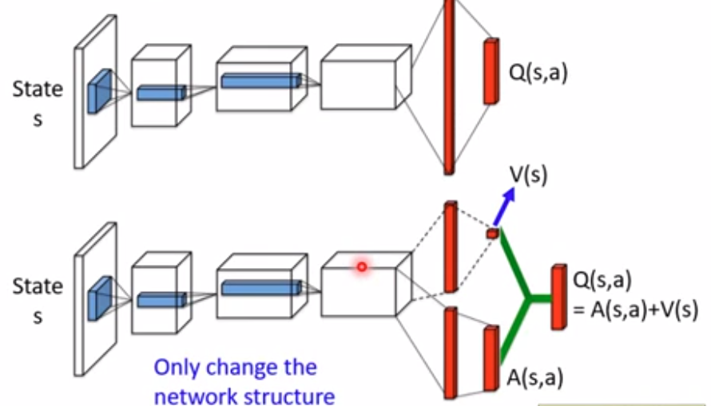

改动network架构。

#### Noisy Net

#### Distributional Q-function

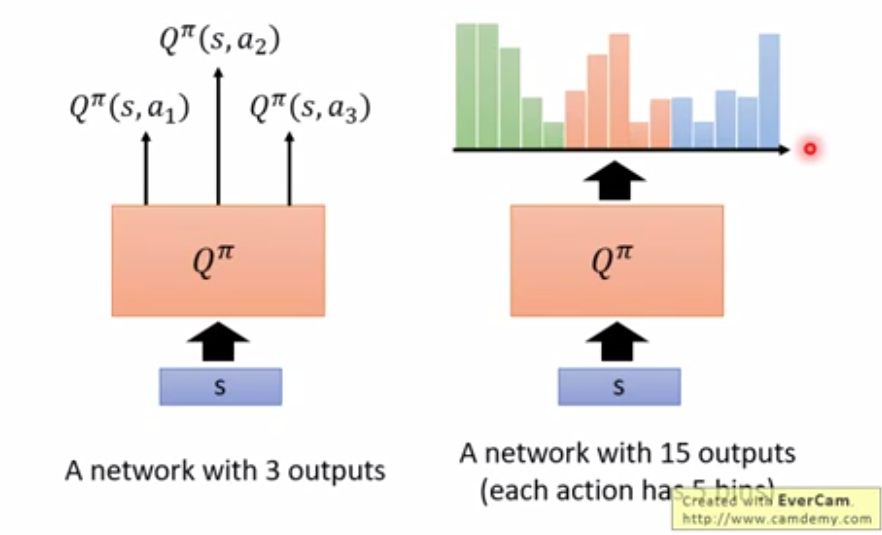

输出分布情况。

#### Q-Leraning for Continuous Actions

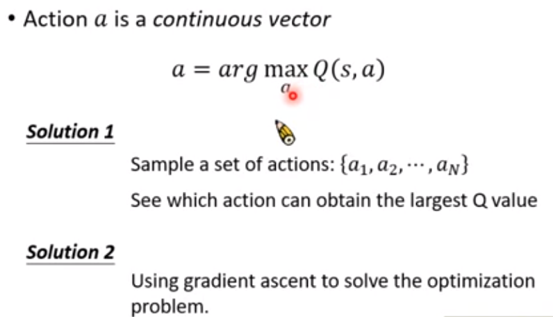

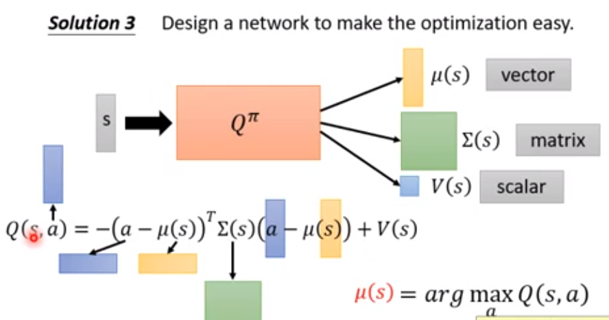

