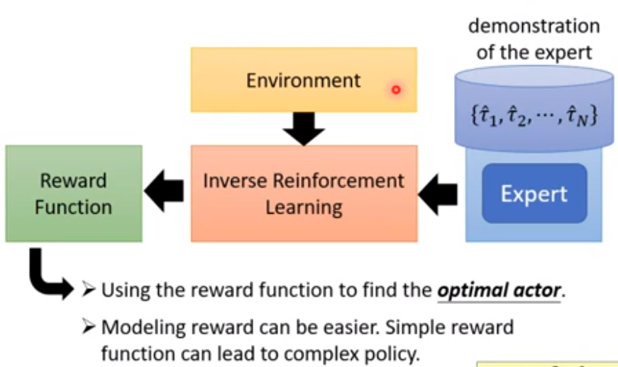
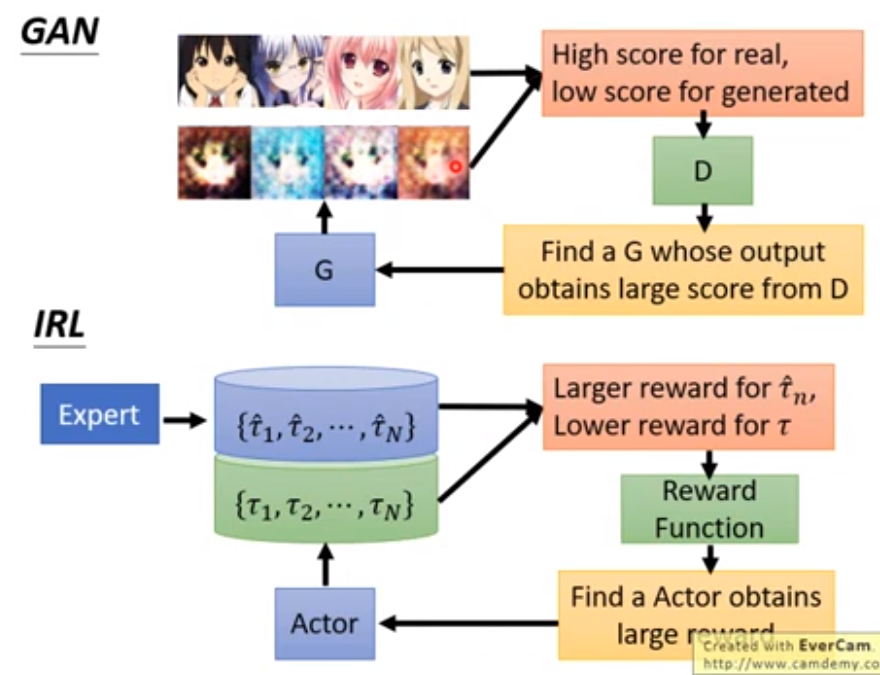

## imitation learning

#### behavior cloning

- 机器将会完全复制人类行为。
- 问题
  - network能力有限，让机器知道哪些行为重要，哪些行为不重要

## Inerse Reinforcement Learning

IRL和GAN网络，使用Actor学习产生新的动作，使得产生的动作在reward function上得到的reward尽可能大。