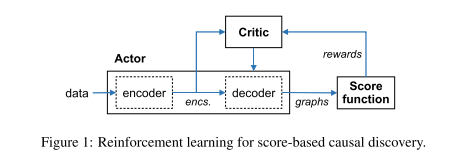

## CAUSAL DISCOVERY WITH REINFORCEMENT LEARNING

使用强化学习（actor-critic）网络搜索有向无环图得到最大score。自定义score function。

#### 方法流程

- 使用encoder-decoder作为actor网络，输入data后返回图邻阶矩阵矩阵，使用score function计算得到rewards后，使用critic网络之后更新actor网络。

- reward设计

  

  reward考虑奖励函数，有向限制，在reward函数中添加两个惩罚因子，用来使得生成的图能够满足相关有向条件。

#### 算法

#### actor-critic网络更新

actor-critic使用策略梯度和随机方法更新参数。

#### 优点

- 使用强化学习作为搜索算法得到图最大score。强化学习reward中考虑将有向约束添加惩罚因子后加入到reward中。之后训练过程需要优化惩罚因子。

#### 缺点

- 训练过程中计算score部分速度较慢，本文使用记录图和score的对应关系，以及将问题分解为单一因果关系问题提高训练速度，可以考虑使用其他计算方法获得更快的计算速度。

#### 借鉴点

- 考虑reward时除了考虑score函数外，还考虑相关图约束，并使用惩罚因子作为限制条件的因子加入到目标函数中。
- 借鉴惩罚因子更新过程
- RL部分使用为常用RL算法，本文将RL算法用于解决传统问题，创新型较好。