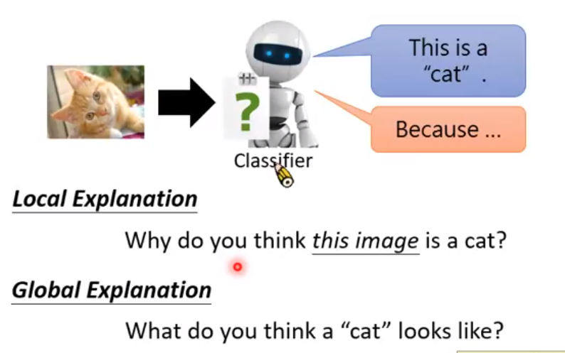
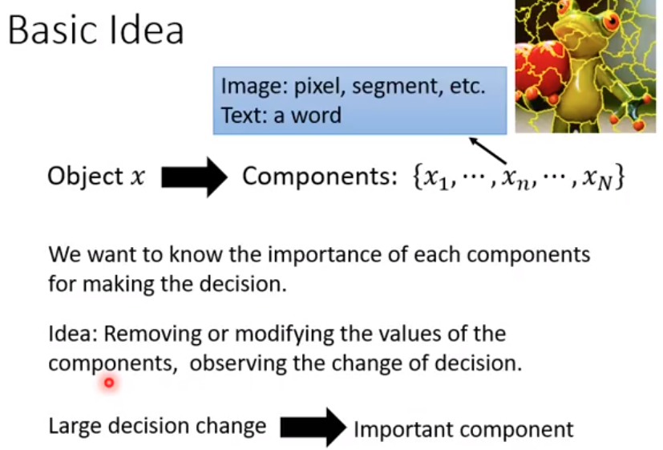
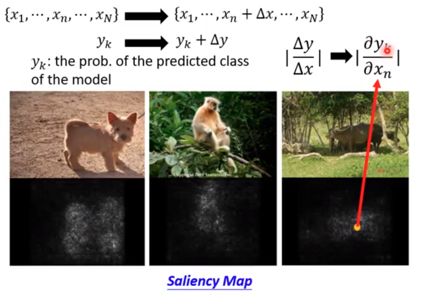
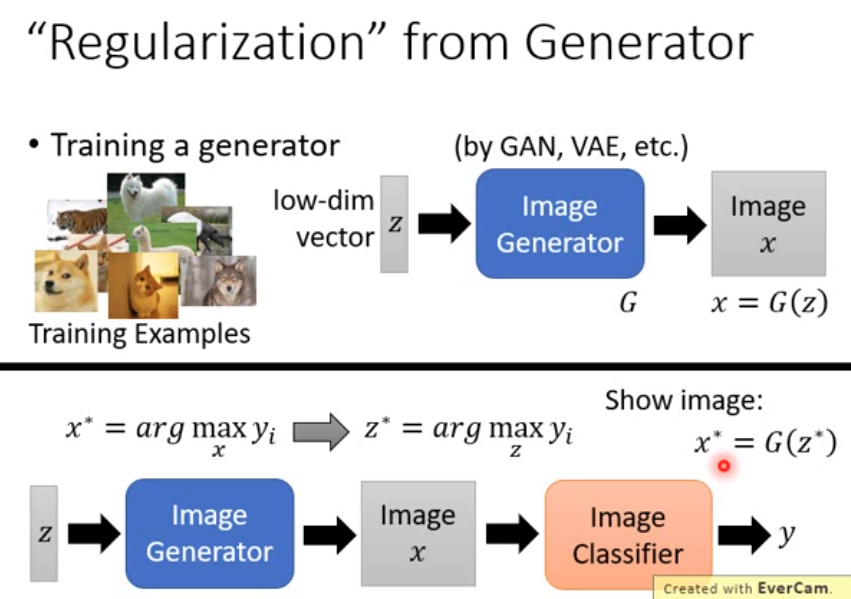
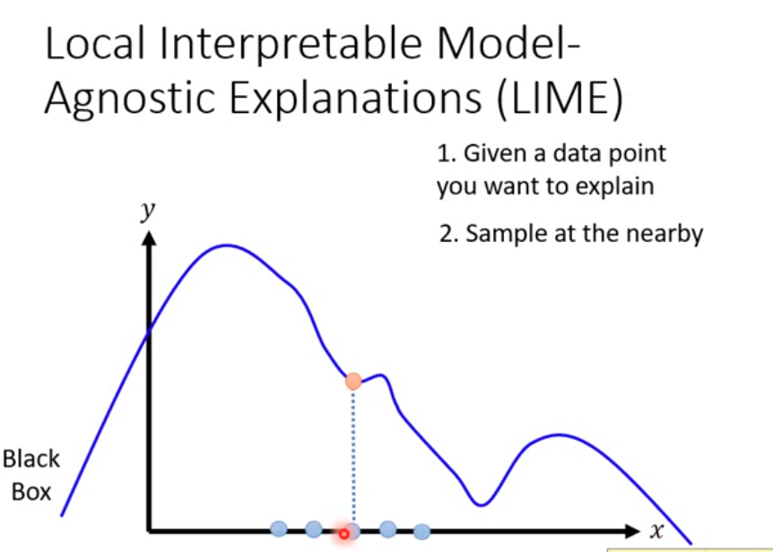
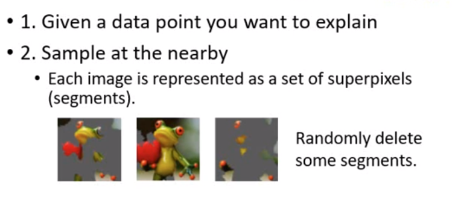
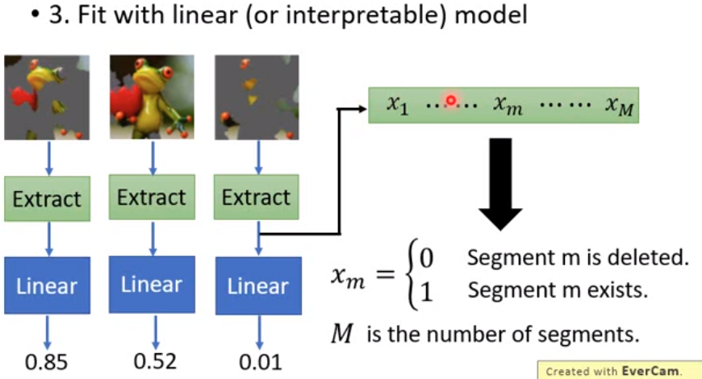
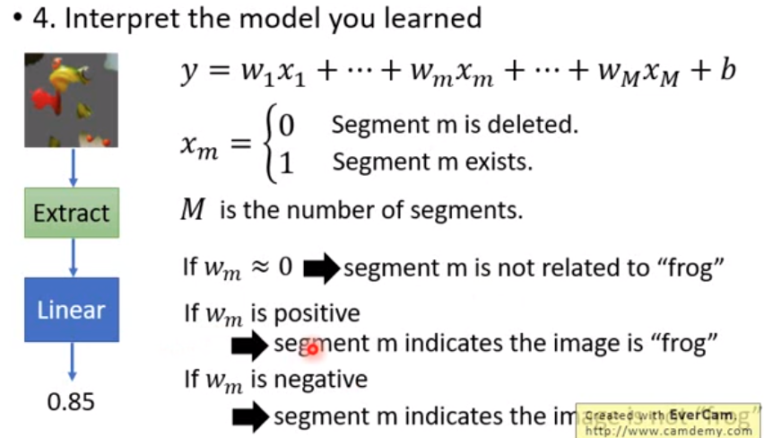
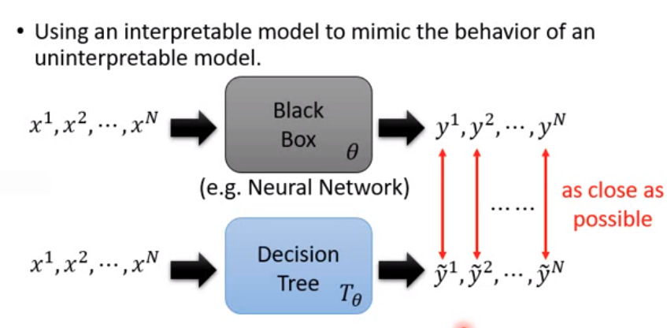
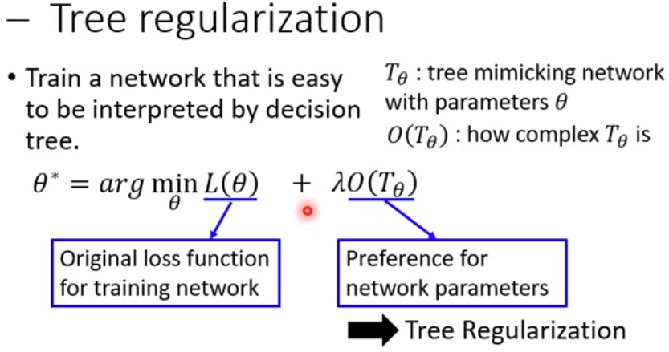

## Explainable ML

- 

  

- **Local Explanation**

  

  将其中一个component除去看对结果的影响

  

  **根据每个计算梯度判断每个segment的重要程度，亮度越亮越重要**

  **使用saliency Map查看网络通过什么部分辨认图片**
  
  

- **生成器**

  

  使用生成器看出网络认为的y是什么样子

- 使用模型解释深度学习模型

  

  使用线性模型模拟黑盒的一部分

- **LIME**

  通常用在local explainon

  

  

  

  使用LIME可以看到对于图像分类模型那些segment是重要的哪些segment时不重要的。

- **Decision Tree**

  使用足够大的决策树能够完全模拟黑盒子

  

  

  **训练一个神经网络，输入一个network之后，能够得到当network转为决策树后得到的树的深度**

  

  

