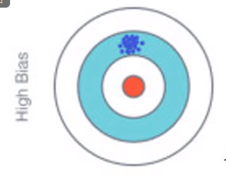
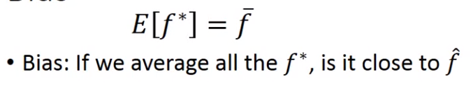
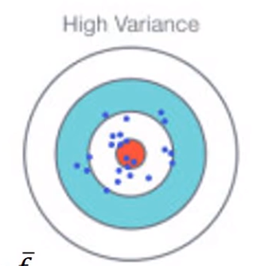
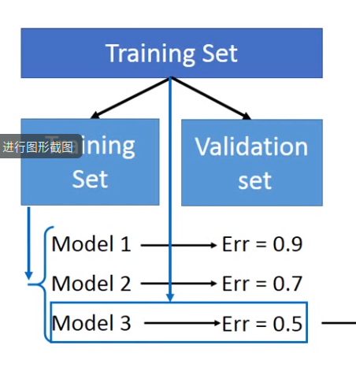
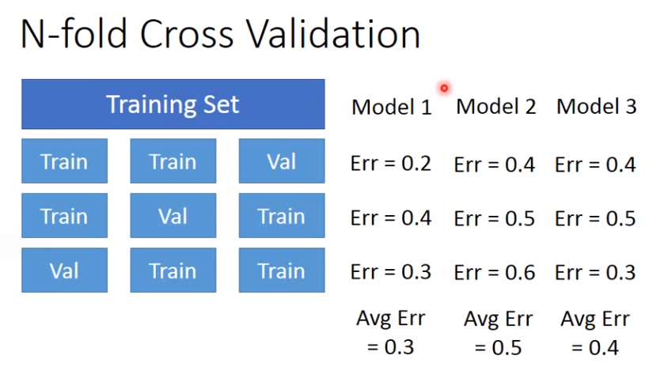

### Gradient descent

### overfitting and regularization

### error function

- error 来源

  - bias

    

    

    bias表示所有模型的平均值与目标值之间的距离。

    **bias过大**容易产生unfitting

  - vriance（方差）

    

    简单model的riance通常较低，复杂model的riance通常较高。

    **virance较大**时容易产生overfitting

  - 判断不同error

    - 模型不能拟合训练数据，bias较大
    - 模型能够很好拟合训练数据，但不能拟合测试数据，virance大

  - 解决

    - bias较大

      重写模型

    - virance较大

      - 增加更多数据

      - regularization(正则化)

        添加一个惩罚项。为了使函数更加平滑。

- 选择一个较为平衡的模型

  选择一个平衡两项误差的模型，最小化总误差。

  - 通常将训练集分为两组：training set  、 Validation set。选择模型后使用全部data训练选择后的模型

  

  - N-fold cross validation

    

    得到model1误差最小，因此使用model1再次训练整个数据集。

  