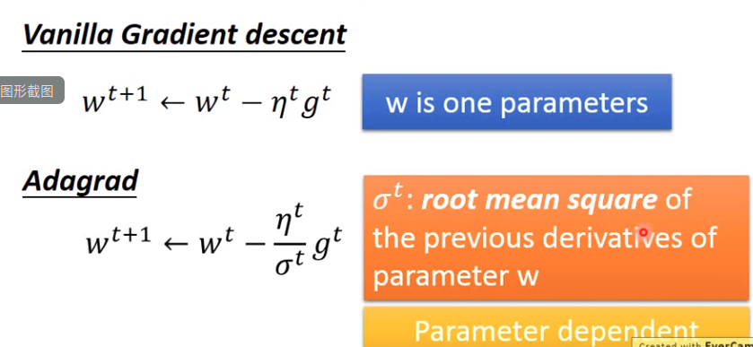

### Gradient Descent

- **基本流程**

  

- **学习率**

  - **学习率通常随着参数迭代逐渐见少**

    多次训练后，比较靠近目标，因此减少学习率

  - **每个不同参数给定不同学习率**

    - **Adagrad**（动态调整学习率）

      

      

      

      adagrad整个收敛过程越来越慢。
      
     - **SGD**

        随机取样本x

        

        每个小训练集使用更新一次参数

        adagrad对所有训练样本每迭代一次更新一次

        

    - **Feature Scaling**
    
    特征放缩，不同feature尽量保证相同scale
    
    - 做法
    
      
    
        
    
    
    
    
    
    
    