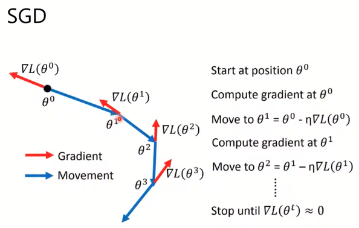

## New Optimizers for Deep Learning

### what is optimization acout

​		

### on-line VS Off-line

- off-line

​	已知所有训练资料

- on-line

  

  每次只知道一对

### SGD

​	

### SGDM

​	

 增加向量v，movement计算时需要使用过去的movement。作用：**添加过去累加项，确保当L趋近于0时，仍然能够保持移动**。如图例子

​	

### Adagrade

 		

   添加一个分母为过去梯度和。避免下降过大导致跳过最低点。因为梯度一直累加，可能导致学习率过小。

### RMSProp

​		

类似adagrade和movement求和。

- 防止梯度过大导致停止。
- 不能处理梯度为0位置

### Adam

​	

### 有点

- SGDM：最终收敛较低

- Adam：收敛速度快

- SWATS

  **结合SGDM和Adam**训练过程中切换

  

- 