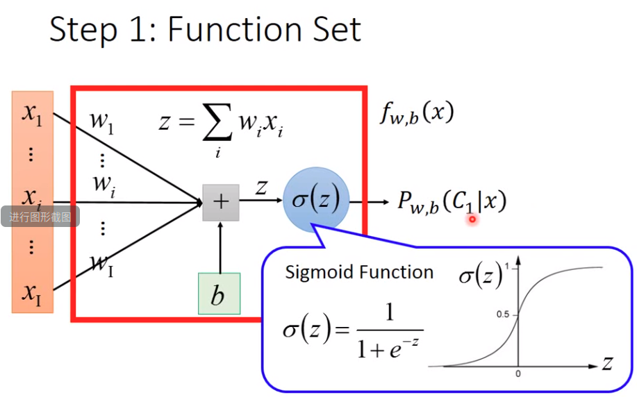
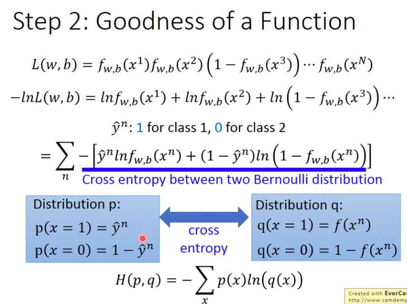
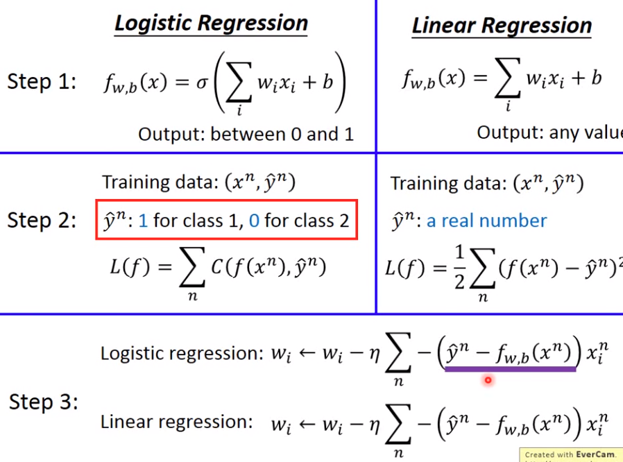
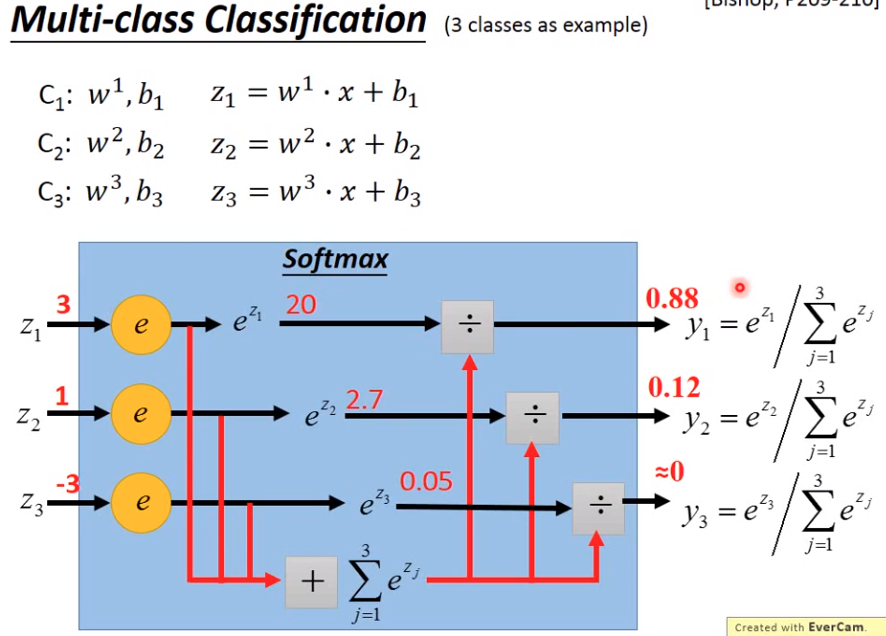
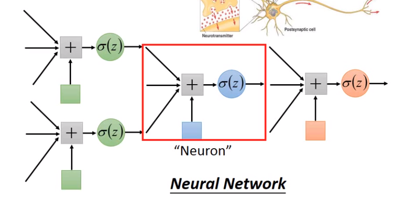

## Logistic Regression

- 概念

  

  得到目标值为某一个分类的概率。使用sigmoid Function之后输出都为0，1之间
  
- function 好坏

  

  交叉熵计算损失。

- 逻辑回归和线性回归比较

  

- cross entropy 和 square error

  

  分类问题时cross entropy距离目标越远则微分越大。

- 多分类原理

  

  输出和为1，强化其中较大的值。
     - **多分类案例**

       

- 特征转换后逻辑回归

  

  使用两个逻辑回归首先进行特征转换，特征转换后在使用一个逻辑回归得到分类结果。

- 类神经网络

  

​      多个逻辑回归相连