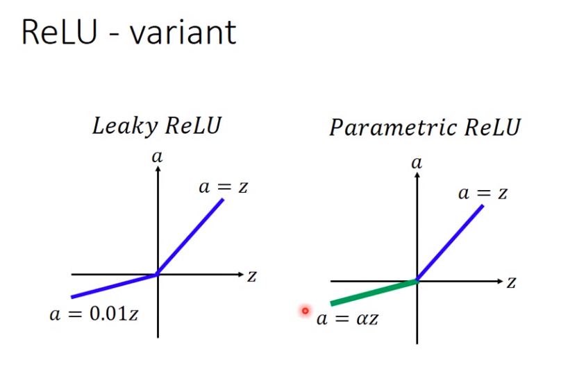

## DNN

使用network为了将目标函数变为非线性

- 激活函数

  - RELU

    

  0点处不可微分。

  - ReLU-variant

    

- Maxout

  Relu时Maxout的一个特殊例子。自动寻找激活函数

  

  可以决定多个element为一个组，例子中为两个element为一个组。

  假设z2为0，则maxout为RELU

  

  假设z2不为0：

  

- 训练Maxout

  **由于存在max函数因此不能微分**

  

  没有接上的部分可以除去。

  

  - 如何处理没有训练到的权重值

    每次给定不同输入x，每次选定z不同，因此所有都会训练到

- Moment优化器

  

  

- Dropout

  

  

  

  不同trainset通过不同model得到的结果平均。

  

  

