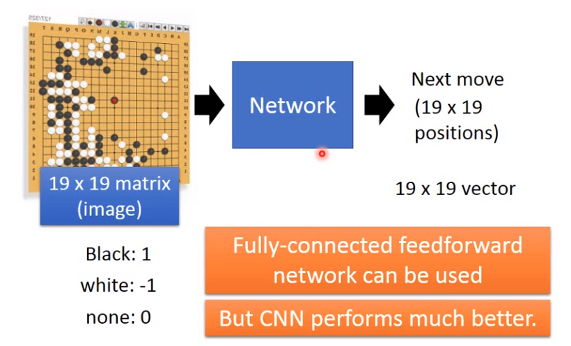

## cnn整个网络

- ### convolution

  - **黑白图片**		

  多少filter就会出现多少结果

  - **彩色图片**

  ​	

  每个filter考虑不同颜色的channel

  - #### filter理解

    

    - 每个filter相当于一个neural
    - 每个neural只关注部分weight
    - neural共享权重

- Max Pooling

  

  四个中选择最大一个保留

  

- CNN - Max pooling之后图像缩小

  

  每次卷积池化后都得到一个更小的image。
  
  2*2 image深度和filter数量相同，经过卷集池化后得到更小的图片。

- whole cnn

  

- flatten

  将矩阵数据换乘一个向量后输入全连接层。

## applicatino

- playing go

  

- speech

  

  声谱图能够分析得到所说内容。

  使用cnn尽心个图像识别，识别得到对应声音。

  cnn的filter应该在cnn的频率方面平移判定不同音表示，

 ## 如何分析cnn 

  

  