## RNN

#### application

- slot filling

  

  

- 词向量化

  - one-hot编码

  - beyond one-hot

    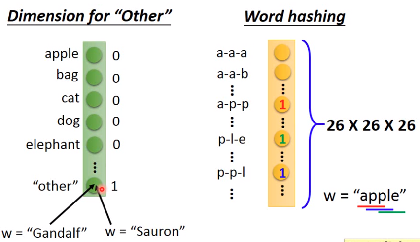

- nerual network做词划分工作的问题

  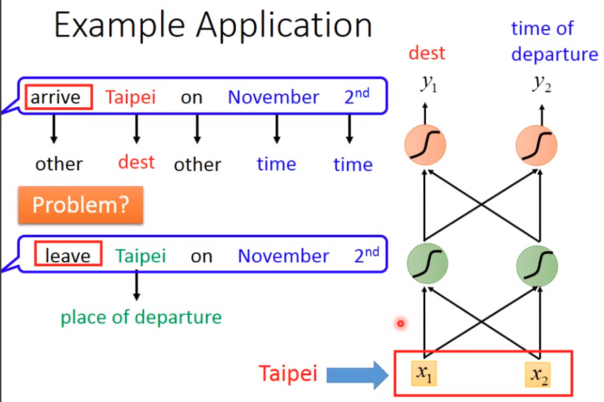

  - 解决方法：使得神经网络有记忆性。

#### RNN

- example

  提前制定内存中的起始值，只有weight，没有bias

  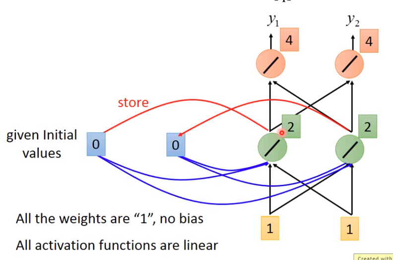

  **输入第二组参数后更新内存中的内容**

  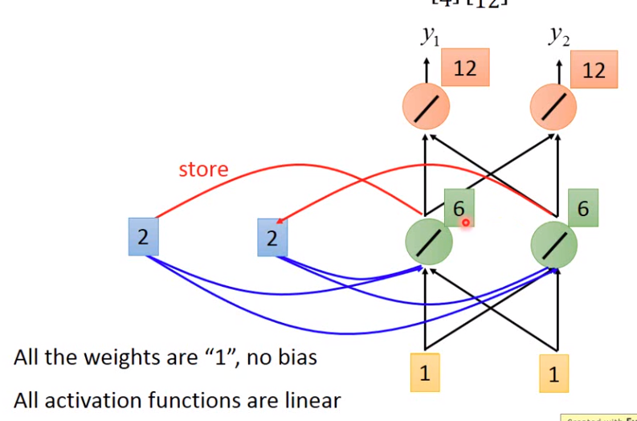

  

- **rnn解决slot filling**

  - 使用一个隐藏层

    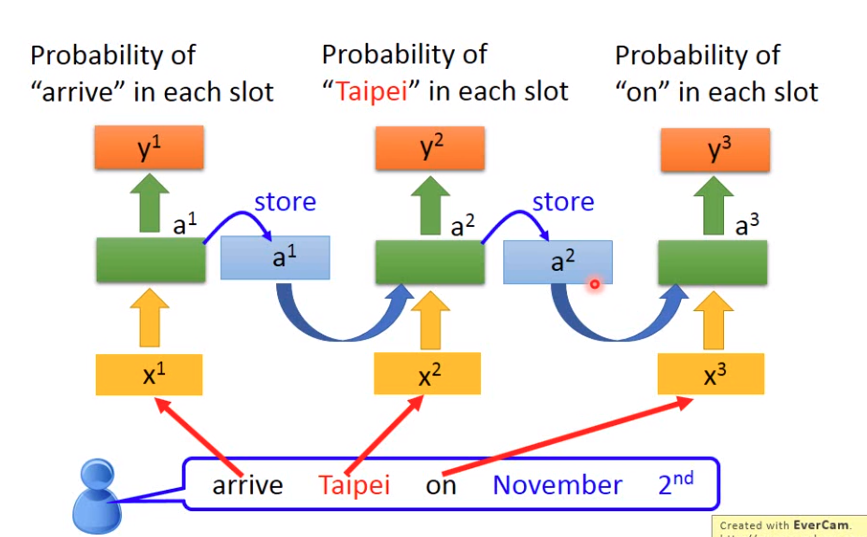

  - 使用深度神经网络

    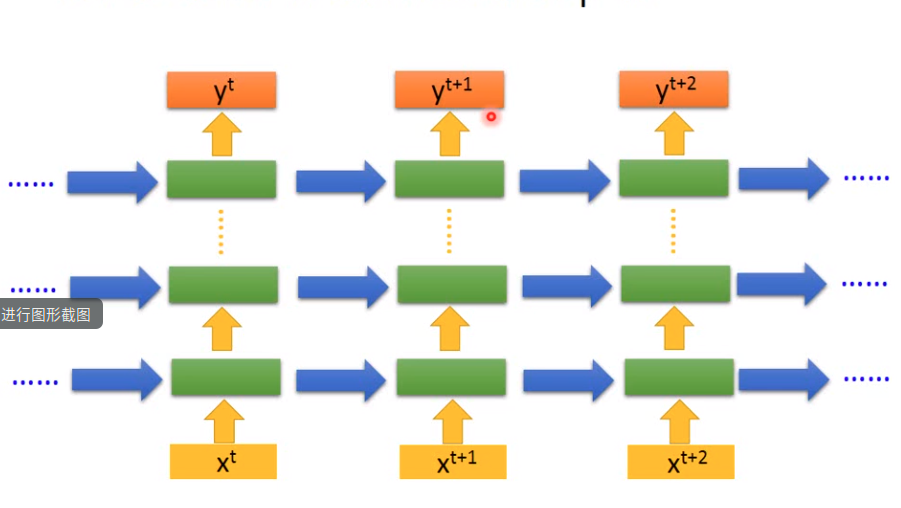

    

- **rnn变形**

  - 双向循环

    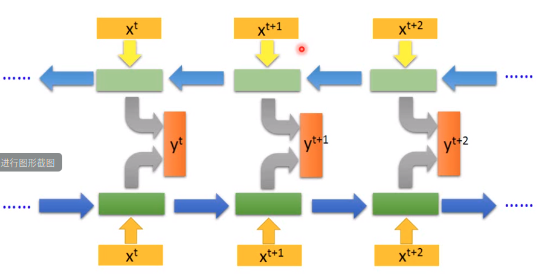

    - 既可以学到从句首到句尾的上下文关系同时有可以学到从句尾到句首的关系

### LSTM

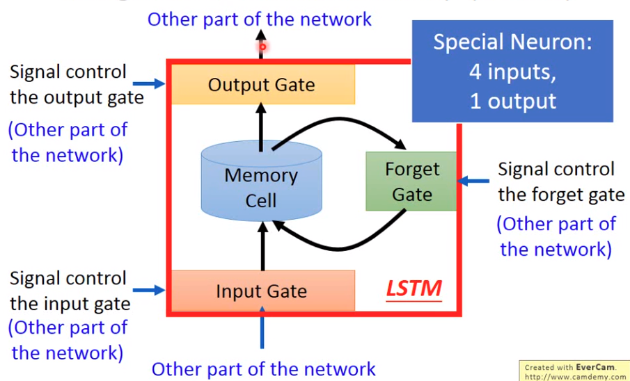

- 4个输入得到一个输出
- 输入门：决定是否存入到memory中
- 输出门：决定是否memory中的记忆是否能用
- forget门：决定memory什么时候忘记记忆

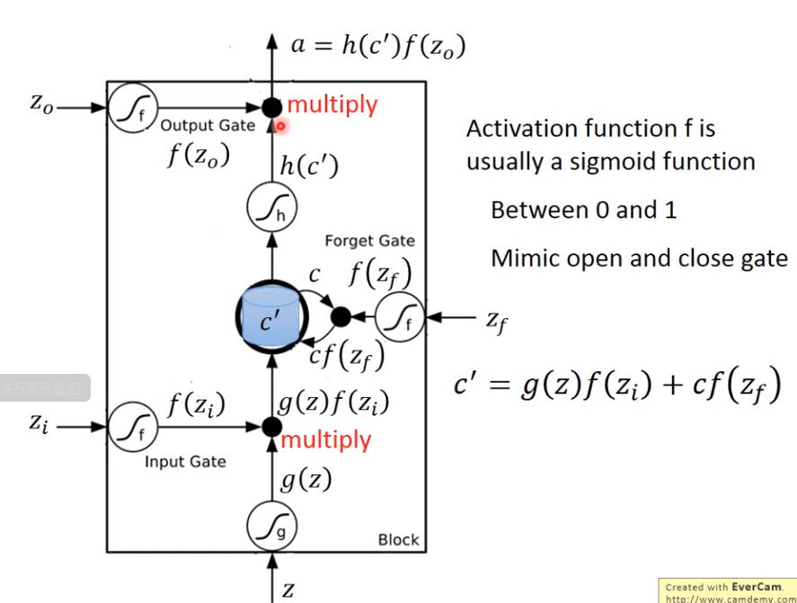

- **LSTM - Example**

  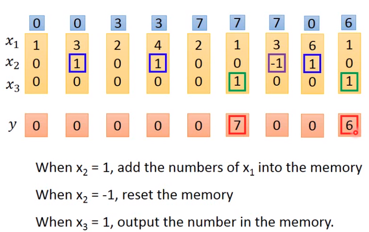

  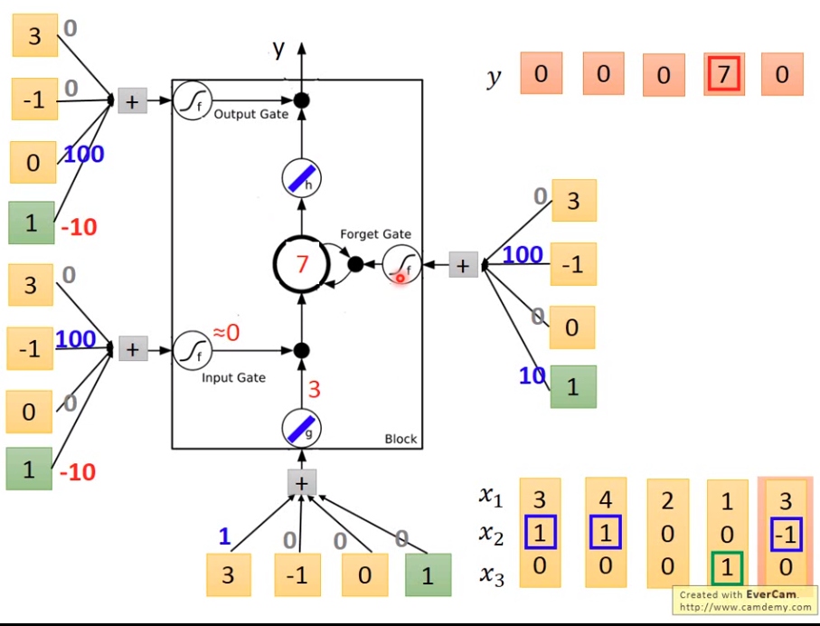

  - **每一个门的权重和偏执都通过梯度下降方式学到**

  - **每个cell都是是一个nerual network**

  - LSTM需要的参数量会是一般的网络的4倍

    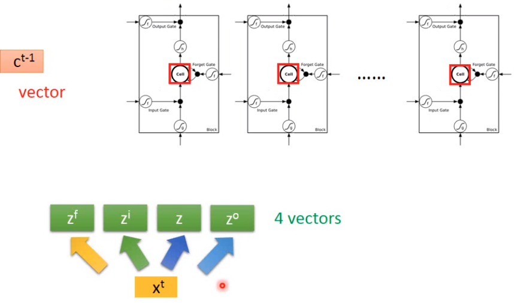

    **x经过4个不同transform得到4个向量**

  - **图对应运算**

    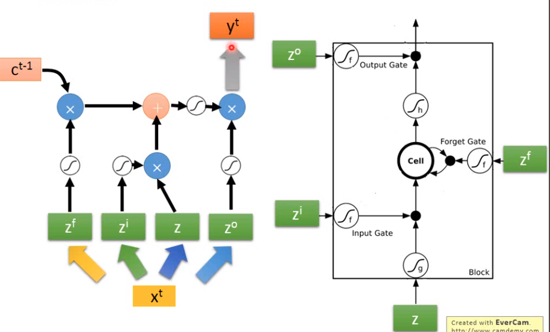

  - **多个cell运算**

    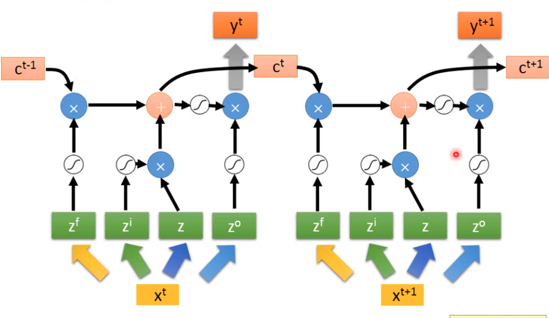

  - **LSTM实际运算**

    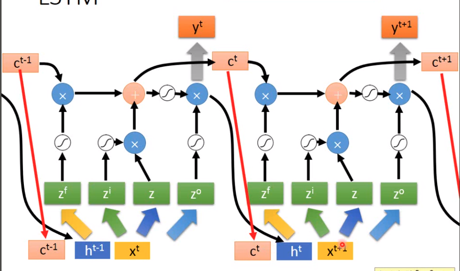

    - 真正LSTM进行transform之前同时考虑输入变量x，上一轮cell中的值，上一轮隐藏层的输出，将三个值同时考虑输入到transform中。